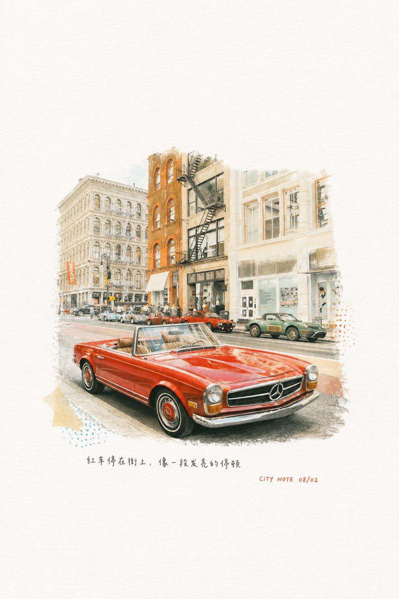
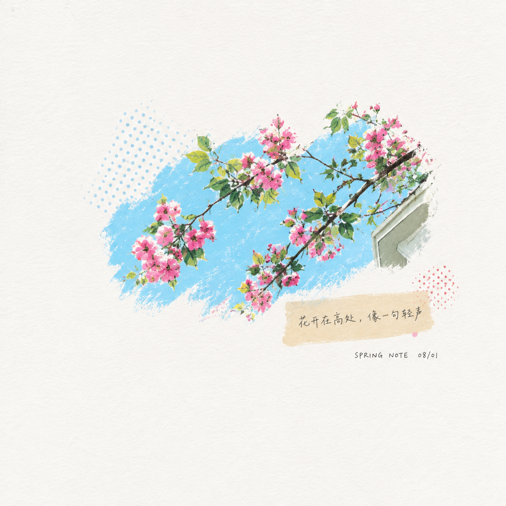
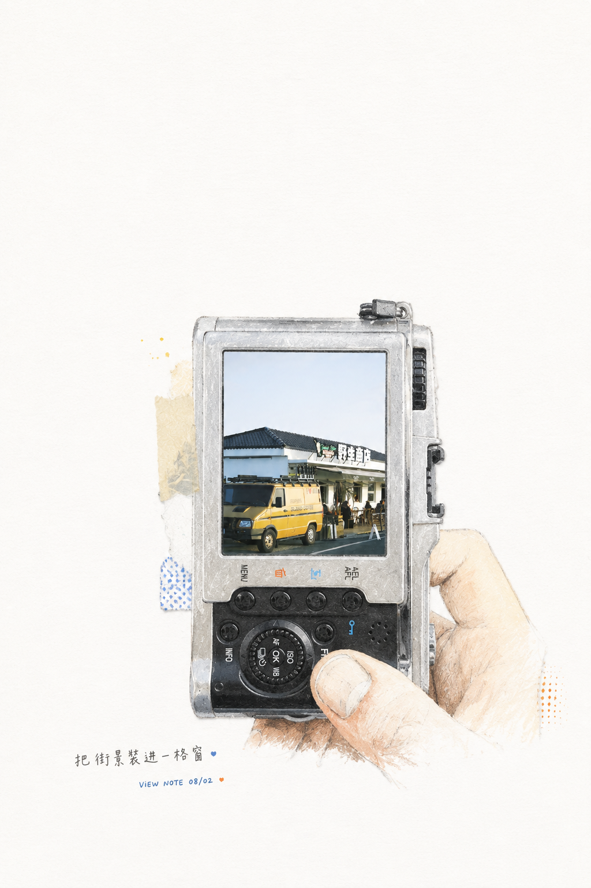
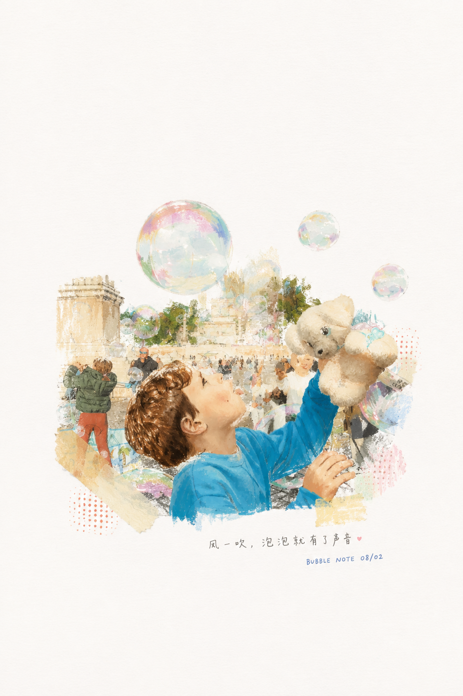
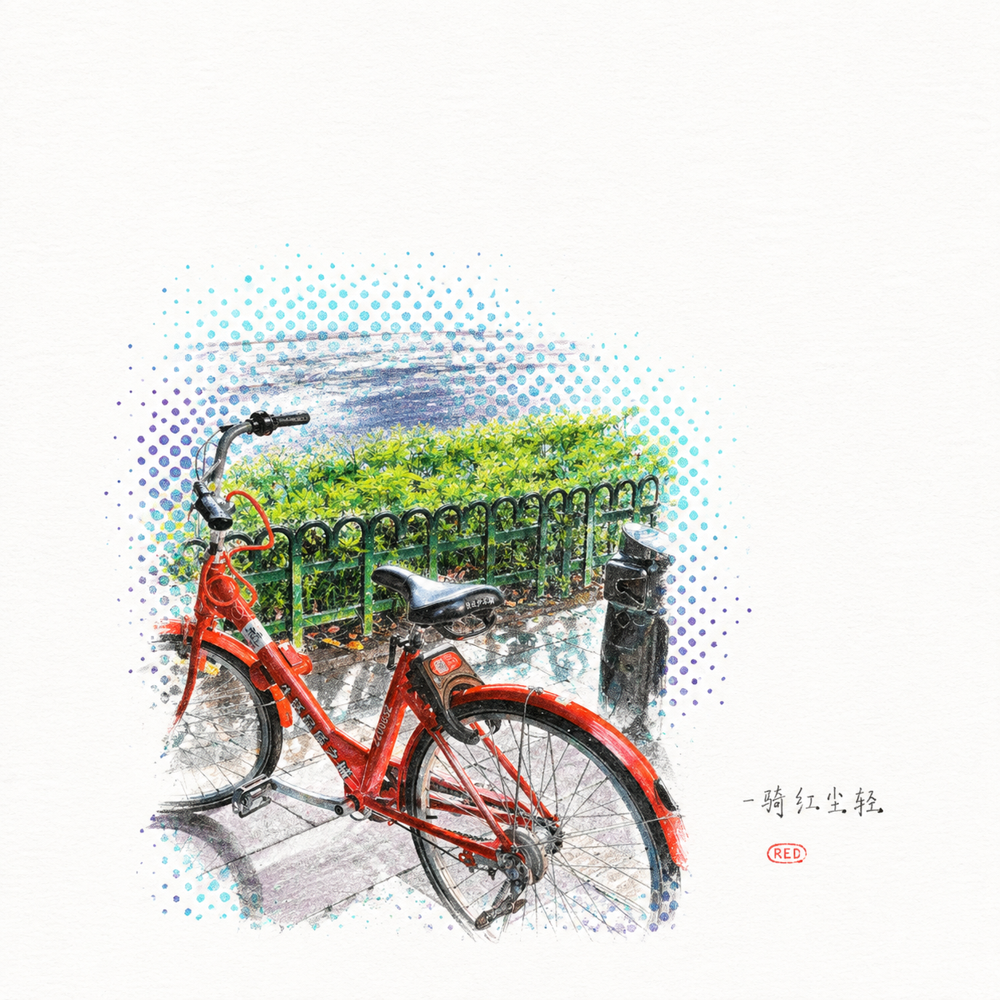
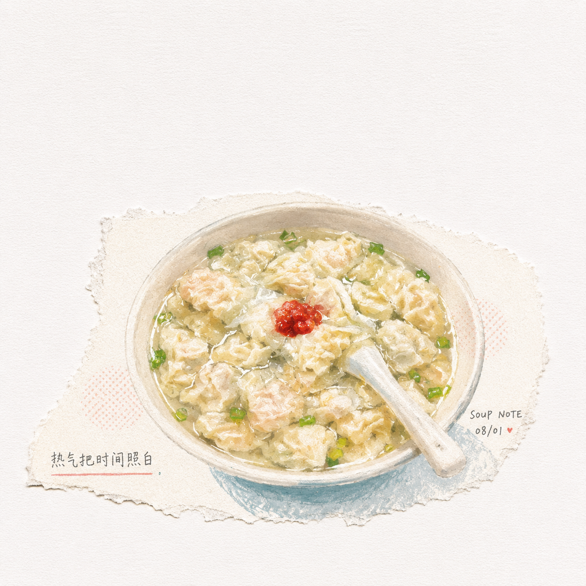
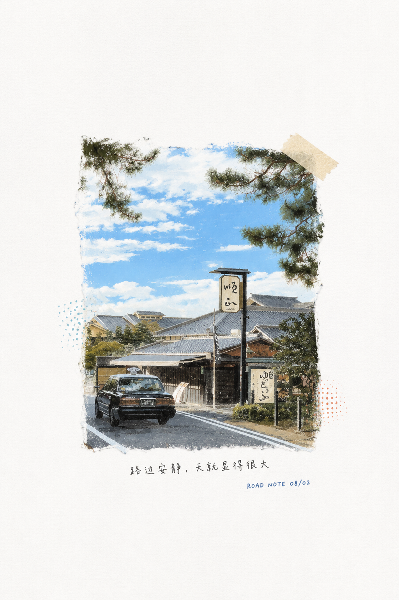
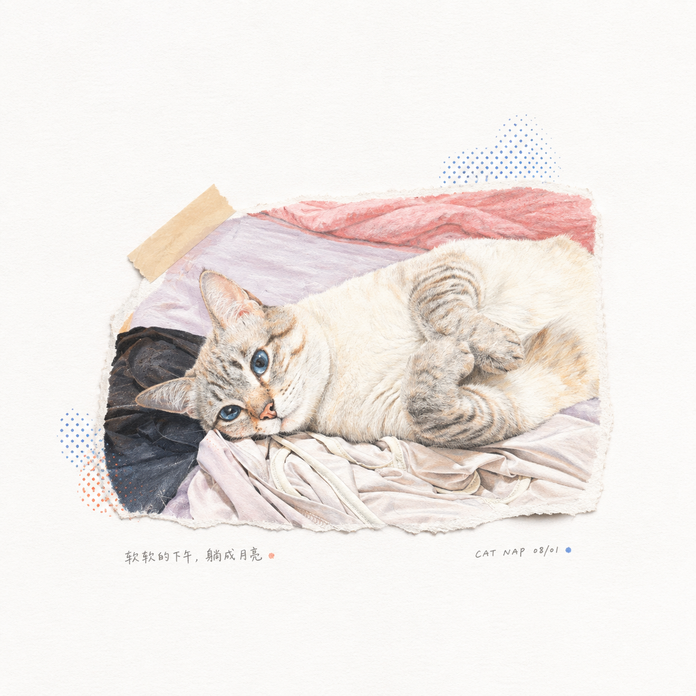
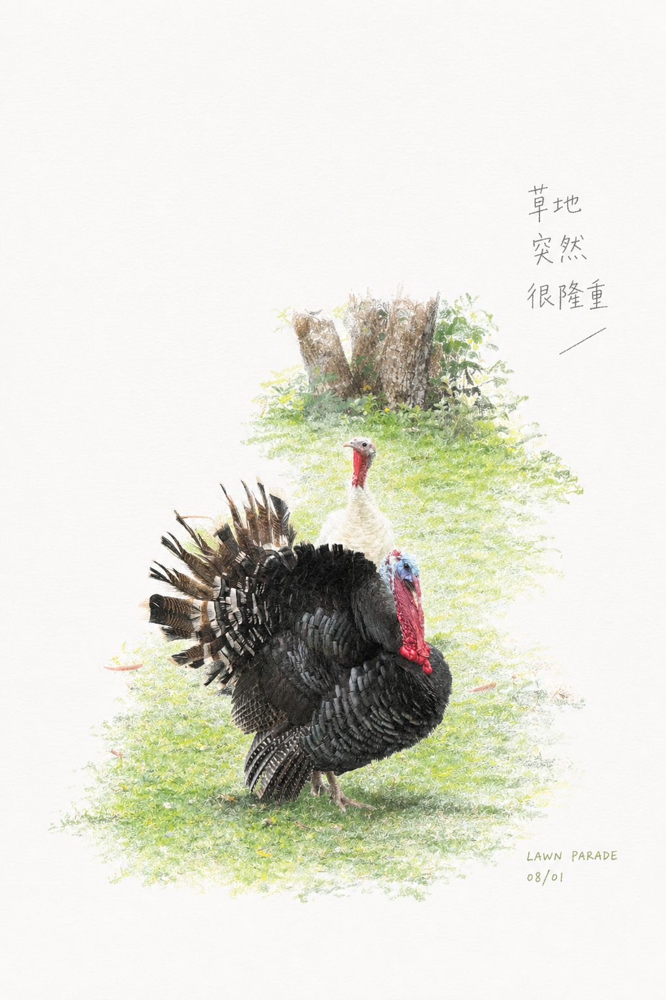

# 废片焕新 / Photo Revival

把普通照片、生活随手拍或不够完美的素材，重新画成一页白纸上的诗性手绘插画。

这个 skill 的重点不是给照片套滤镜，而是保留照片里的主体、空间和记忆点，再用新的插画语言重绘：大面积留白、白纸质感、小比例画面、局部高饱和色彩、轻微手写注释。

## Use

```text
Use $photo-revival to turn this photo into a 3:4 poetic hand-drawn illustration with a white paper field, large negative space, vivid localized color, subtle collage accents, and tiny handwritten captions.
```

## Style

- 3:4 vertical page
- white or near-white paper texture
- large empty space
- small hand-drawn subject
- vivid color only in a small area
- tiny Chinese or English handwritten notes
- no full-bleed photo filter look

## Samples

| | | |
|---|---|---|
|  |  |  |
|  |  |  |
|  |  |  |
|  |  |  |
|  |  |  |
|  |  | |

## Files

- `SKILL.md` contains the agent instructions.
- `agents/openai.yaml` contains display metadata.
- `examples/` contains public sample images.
